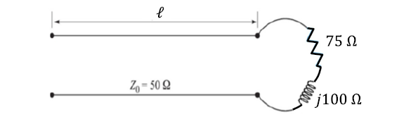

# Questão 2
## Problema
- Calculue o casamento de impedancia em série com elemento reativo para o esquema abaixo

- Para $Z_0 = 50 \Omega$, $Z_l = 75+j100 \Omega$ e $f = 100 MHz$

## O que foi feito:
- Programa que resolve qualquer tipo de casamento de impedância simples
- Recebe os valores de $Z_L,Z_0,f$ por uma Interface gráfica
- Retorna carta smith com os pontos normazilados plotados e circulo de $\tau_L$
- Retorna na interface os dois resultados possíveis com seguintes dados:
    - Impedancia casada ($Z_{d1}\ e\ Z_{d2}$)
    - Distância percorrida na carta ($d1 \ e \ d2$)
    - Elemento reativo conectado em série ($Capacitor\ ou \ indutor$)
    - Valor do elemento reativo concetacto ($F\ ou\ H$)
## Ferramentas:
- numpy
- cmath
- matplotlib
- tkinter

